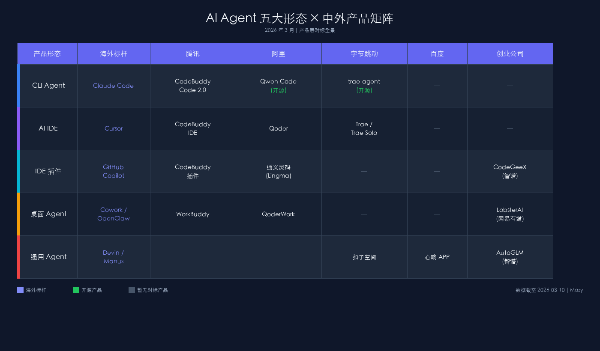
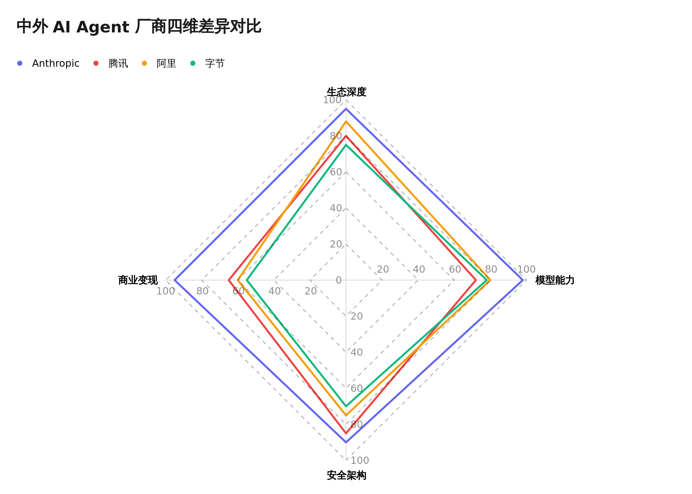

# 中外 AI Agent 产品层对标全景图：从 Claude Code/Cowork 到国内大厂的追赶与分化

> **TL;DR** — 2026 年 3 月，AI Agent 产品层已形成 CLI Agent、AI IDE、IDE 插件、桌面 Agent、移动 Agent、通用 Agent 六大形态。海外以 Anthropic（Claude Code + Cowork）和 OpenClaw 为标杆，国内掀起"龙虾风暴"——腾讯 QClaw/WorkBuddy、智谱 AutoClaw、阿里 HiClaw、小米 miclaw、网易有道 LobsterAI 等 20+ 款产品密集发布，Coding Plan 价格战白热化至 7.9 元/月。但产品"形似"之后，生态深度、安全架构和商业模式的差异正在成为下半场的分水岭。

---

## 一、背景：为什么现在谈 Agent 产品层？

2025 年被称为"Agent 应用元年"。进入 2026 年，战场从模型能力之争迅速转向产品层的全面角逐。

三个事件标志着这一转折：

**第一，Claude Code 跑出 $1B ARR。** Anthropic 的命令行 AI 编程工具在 2025 年 Q4 达到 10 亿美元年化收入，证明"AI Agent 即产品"的商业逻辑成立——不再只是模型 API 的套壳应用，而是有独立付费意愿的生产力工具。

**第二，OpenClaw 4 个月 24 万 Star。** 从奥地利开发者 Peter Steinberger 的个人项目 Clawdbot（2025 年 11 月）到三次更名（Clawdbot → MoltBot → OpenClaw），再到 2026 年 2 月创始人加入 OpenAI、项目移交独立基金会——这只"开源龙虾"创造了 GitHub 史上最快增长纪录，超越 Linux 和 React。ClawHub 上 5700+ Skills 的生态更证明了"Skill 自举"这一范式的威力。黄仁勋在摩根士丹利会议上将 OpenClaw 称为"我们这个时代最重要的软件发布"。

**第三，国内"龙虾风暴"全面爆发。** 仅 2026 年 3 月 9-10 日两天内：腾讯上线 WorkBuddy 并内测 QClaw（微信直连 OpenClaw）、智谱发布 AutoClaw（澳龙，一键部署 + 预置 50+ Skills）、小米内测 miclaw（移动端 AI Agent）。加上此前的阿里 HiClaw、网易有道 LobsterAI、昆仑万维 Sky Bot，国内已形成 20+ 款 OpenClaw 对标/兼容产品。深圳腾讯总部甚至出现了近千人排队安装 OpenClaw 的盛况。各家不再只做"一个产品"，而是覆盖完整的产品形态矩阵。

这不再是"谁的模型更强"的问题，而是"谁的产品矩阵更完整、生态更深"的系统性竞争。

---

## 二、海外标杆：六大产品形态

在进入国内对标之前，先厘清海外已经跑通的六大产品形态。

### 1. CLI Agent（命令行智能体）

**代表产品：Claude Code**

开发者在终端输入自然语言，Agent 自主读代码、改文件、跑测试、提交 Git。2025 年 2 月预览、5 月随 Claude 4 正式发布，到 Q4 已达 $1B ARR。核心价值不是"代码补全"，而是"代码执行"——从提示到提交，全链路自主完成。

配合 Claude 4.5 Opus 和后续的 Opus 4.6 模型，Claude Code 在多文件重构任务上的成功率比竞品高 20-40%。

### 2. AI IDE（AI 原生集成开发环境）

**代表产品：Cursor**

在 VS Code 基础上重建的 AI 原生 IDE，将代码补全、对话、Agent 任务融为一体。2025-2026 年推出 Background Agents，支持并行处理多个编码任务。形态优势是"所见即所得"——开发者不离开编辑器就能完成从提问到修改的闭环。

### 3. IDE 插件

**代表产品：GitHub Copilot**

最早起步、渗透率最高的形态。作为现有 IDE 的插件存在，学习成本最低。但受限于插件架构，难以实现跨文件的深度 Agent 行为。2025 年后逐渐被 AI IDE 和 CLI Agent 的体验超越。

### 4. 桌面 Agent（Desktop Agent）

**代表产品：Claude Cowork / OpenClaw**

两者定位有显著差异：

- **Cowork**（2026 年 1 月研究预览）：Anthropic 官方的桌面 AI 工具，面向非技术用户，处理文件整理、表格处理、邮件自动化等办公任务。所有操作需用户授权，运行在隔离沙箱中。安全优先。
- **OpenClaw**（Clawdbot → MoltBot → OpenClaw）：开源社区驱动，GitHub 24 万 Star。用户通过 WhatsApp/Telegram/企微远程遥控本地电脑执行任务。核心创新是"Skill 自举"——Agent 遇到未知任务时自主编写 Skill，封装为 SKILL.md 复用。项目代码几乎 100% 由 AI 生成，创始人未手写一行代码。2026 年 2 月创始人 Steinberger 加入 OpenAI，项目移交独立基金会管理。自由度优先。

### 5. 移动 Agent（Mobile Agent）

**新兴形态，尚无海外统治级产品**

2026 年 Q1 出现的新形态——AI Agent 从桌面延伸到移动端，深度集成手机操作系统，可自主操作 App、管理日程、控制 IoT 设备。与桌面 Agent 相比，移动 Agent 面临更严格的权限管控和更复杂的多 App 协调问题。目前以中国厂商领先（小米 miclaw、百度心响），海外尚处萌芽期。

### 6. 通用 Agent（General-Purpose Agent）

**代表产品：Devin / Manus**

- **Devin**（Cognition AI）：定位"首个 AI 软件工程师"，专注代码任务的端到端自主执行。
- **Manus**（Monica/蝴蝶效应）：中国团队打造的通用 Agent，覆盖研究、报告、数据分析等多领域。采用规划-执行-验证三代理架构。ARR 突破 $1 亿后被 Meta 以超 $20 亿收购。

---

## 三、国内全景对标

### 腾讯：三线并进，"龙虾"生态最深入

腾讯是国内 OpenClaw 生态介入最深的大厂，三款产品形成开发者→办公→社交的完整链路。

| 产品 | 形态 | 对标 | 状态 |
|------|------|------|------|
| CodeBuddy Code 2.0 | CLI Agent | Claude Code | 已发布 |
| CodeBuddy IDE | AI IDE | Cursor | 已发布 |
| WorkBuddy | 桌面 Agent | Cowork / OpenClaw | 2026-03-09 正式上线 |
| **QClaw** | 桌面 Agent（社交入口）| OpenClaw + 微信 | 内测中（03-09） |

**CodeBuddy** 在腾讯内部渗透率超 90%，编码时间平均缩短 40%，AI 生成代码占比超 50%。2.0 版本开放 SDK 支持被集成，支持 Plugin 插件市场和隔离沙箱运行环境。模型层支持 GPT-5.2-Codex、Gemini 3 Pro 等海外顶级模型，国内版接入 DeepSeek-V3、GLM-4.7 等。

**WorkBuddy** 的差异化在于"腾讯全家桶连接"——打通企微、QQ、飞书、钉钉，支持手机远程遥控桌面 Agent。技术架构为"本地沙盒执行 + 多模型调度 + 安全网关防护"。完全兼容 OpenClaw Skills，但降低了部署门槛：从下载到连接企微，最快 1 分钟。内测期已覆盖 2000+ 名员工，涵盖 HR、行政、运营、销售等非技术岗位。

**QClaw** 是腾讯电脑管家团队推出的杀手锏——将 OpenClaw 直接嵌入微信和 QQ。用户在微信聊天框中对话即可远程控制家中电脑执行任务（文件操作、网页自动化、社媒运营、GitHub 项目开发等）。QClaw 不是重写 OpenClaw，而是围绕它做产品化封装：一键部署、默认集成 Kimi/MiniMax/GLM/DeepSeek 等多模型、数据完全本地不经云端。作为腾讯官方产品，QClaw 的核心优势在于合规性——避免了第三方接入微信的封号风险。这意味着 OpenClaw 有机会触达微信 14 亿用户池。

### 阿里：五线齐发，开源策略最激进

阿里是产品线最完整的国内玩家，五款产品覆盖五大形态。

| 产品 | 形态 | 对标 | 特色 |
|------|------|------|------|
| Qoder | AI IDE | Cursor | Qwen3-Max 驱动，价格约 Cursor 一半 |
| Qwen Code | CLI Agent | Claude Code | Apache 2.0 开源，每日 2000 次免费 |
| 通义灵码（Lingma）| IDE 插件 | GitHub Copilot | 公安部 C3 认证，金融/政务场景 |
| QoderWork | 桌面 Agent | Cowork / OpenClaw | 桌面 Agent，随 Qoder 生态发布 |
| **HiClaw** | 团队版 OpenClaw | OpenClaw (Team) | Higress 团队开源，Manager/Worker 架构 |

关键差异化：**开源 + 免费策略**。Qwen Code 采用 Apache 2.0 完全开源，支持 Skills、SubAgents、Plan Mode 等高级功能，兼容 Anthropic/Google/OpenAI 协议。底层 Qwen3-Coder（480B 参数 MoE 架构）支持 119 种编程语言，原生 256K 上下文可扩展至 1M。

**HiClaw** 是阿里云 Higress 团队新开源的"Team 版 OpenClaw"，定位中小团队协作场景。采用 Manager/Worker 架构，Manager 统筹任务分配，Worker 执行具体操作。与个人版 OpenClaw 的核心区别在于支持多人共享 Agent 资源池和统一 Skill 管理。

阿里云百炼更以 **7.9 元/月**新用户价引爆 Coding Plan 市场，将 Qwen3.5、GLM-5、Kimi K2.5、MiniMax M2.5 四大编程模型打包进同一套餐，支持 10+ 款主流 AI 编程工具。

阿里的基础设施投入也是国内最大：2025-2027 三年 3800 亿元用于云和 AI 基础设施。

### 字节跳动：IDE 先行，Solo 模式突围

字节选择了不同的路径——先用 AI IDE 占领开发者心智，再向 Agent 平台扩展。

| 产品 | 形态 | 对标 | 特色 |
|------|------|------|------|
| Trae | AI IDE | Cursor | 支持 GPT-5.x / Gemini 3 等多模型切换 |
| Trae Solo | 自主 Agent 模式 | Devin | AI 主导全流程：需求→代码→测试→预览 |
| trae-agent | 开源 CLI Agent | Claude Code | GitHub 上万 Star |
| 扣子 2.0（Coze 2.0）| 通用 Agent 平台 | — | AgentSkills / AgentPlan / AgentCoding / AgentOffice 四大核心能力 |

**Trae Solo** 是字节的关键创新：在"双模编程"中，Solo 模式让 AI 完全主导任务执行，从需求理解到代码预览全链路自主完成。这实质上是在 IDE 框架内实现了类 Devin 的体验。Trae 2026 年新增 Memory 增强功能，支持跨会话记忆。

**扣子 2.0** 升级了四大核心能力：AgentSkills（技能封装）、AgentPlan（长期规划）、AgentCoding（扣子编程）、AgentOffice（深度办公），从"给指令的工具"升级为"能干活的工作伙伴"。

字节 2026 年计划投入 1600 亿元用于 AI 研发，稳坐国内投入第一梯队。

### 百度：模型+行业双优势，编程工具补位

| 产品 | 形态 | 对标 | 特色 |
|------|------|------|------|
| **文心快码（Comate）** | IDE 插件 / Agent | GitHub Copilot + Agent | IDC 9 项指标 8 项满分；Multi-Agent 矩阵（Zulu/Plan/Architect） |
| 心响 APP | 移动 Agent | Manus（移动端） | 首个移动端通用超级智能体 |
| 文心智能体平台 | Agent 平台 | — | 数十万活跃 Agent，垂直领域强 |
| 文心 5.0 | 基础模型 | GPT-5 / Claude 4 | 2.4 万亿参数，40+ 基准超越竞品 |

百度在模型层依然强劲（文心 5.0 在 40+ 权威基准测试中表现优异）。此前在 AI 编程产品层的短板正通过 **文心快码（Comate）** 补齐——IDC 最新技术评估中 9 项指标斩获 8 项满分，C++ 生成质量行业第一。其创新在于 Multi-Agent 矩阵架构：Zulu Agent 拆解复杂架构、Plan Agent 澄清需求、Architect Agent 执行编码，三者协同完成开发任务。

百度的优势领域仍是垂直行业 Agent：法律咨询、医疗辅助、教育等，2025 年以 210 个中标项目、约 23.16 亿元蝉联大模型"标王"。

### 创业公司 & 新玩家：OpenClaw 对标产品井喷

| 公司 | 核心产品 | 定位 | 亮点数据 |
|------|---------|------|---------|
| **智谱 AI** | **AutoClaw（澳龙）** / CodeGeeX / GLM-5 | 一键部署 OpenClaw + 编程模型 | 3/10 发布即推动股价涨 12%，市值破 3000 亿；预置 50+ Skills；内置 Pony-Alpha-2 龙虾专属模型 |
| **小米** | **miclaw** | 移动端 AI Agent | MiMo 模型驱动，50+ 系统工具，支持 MCP 协议；打通人-车-家全生态；Xiaomi 17 系列封闭内测 |
| **网易有道** | **LobsterAI 0.2.2** | 桌面 Agent | "中国版 OpenClaw"；Electron + React GUI 双击安装；0.2.2 版深度适配企微、QQ、钉钉、飞书 |
| MiniMax | M2.5 编程模型 | 全栈编程模型 | VIBE 榜 88.6 分接近 Claude Opus 4.5；Starter 套餐 29 元/月 |
| 月之暗面 | Kimi K2.5 | 编程模型 | 256K 上下文，工具调用格式正确率 100%，兼容 Anthropic API；支持截图 Vibe Coding |
| **昆仑万维** | **Sky Bot** | 桌面 Agent 平台 | 自研，支持自托管部署和跨应用操作 |

**智谱 AutoClaw（澳龙）** 是 3 月 10 日的重磅发布。定位"国内首个真·一键安装的本地版 OpenClaw"——macOS/Windows 双平台支持，下载安装如同普通 App，1 分钟完成。预置 50+ 热门 Skills 覆盖内容创作、办公自动化、代码开发、营销、金融等场景。内置智谱专为 OpenClaw 深度优化的 **Pony-Alpha-2** 模型（龙虾专属），在工具调用稳定性和长链路任务推进上表现突出。还集成了自研 AutoGLM-Browser-Agent 浏览器自动化技能。完全开放模型接入，支持 DeepSeek、Kimi、MiniMax、GLM 等。

**小米 miclaw** 代表了一个全新形态——**移动端 AI Agent**。基于小米自研 MiMo 大模型，深度集成 HyperOS 操作系统，将手机、汽车、电视、家电都变成 AI 执行节点。采用推理-执行循环架构，封装 50+ 系统工具，支持 MCP 协议接入第三方能力。隐私设计方面：敏感权限需运行时授权，高风险操作（发消息、创建日程）触发 60 秒自动拒绝确认弹窗，默认不含支付/转账/下单工具。目前仅 Xiaomi 17 系列设备封闭内测。

**网易有道 LobsterAI** 在 2 月 11 日首发后，0.2.2 版已深度适配国内企业协作生态，正式接入企微和 QQ Bot，覆盖钉钉、飞书等主流 IM。与 OpenClaw 的"极客风"不同，LobsterAI 主打"零门槛"——Electron + React 构建的精美 GUI，双击安装，无需命令行和环境配置。

---

## 四、对标全景表

| 产品形态 | 海外标杆 | 腾讯 | 阿里 | 字节 | 百度 | 创业公司 & 新玩家 |
|---------|---------|------|------|------|------|---------|
| **CLI Agent** | Claude Code | CodeBuddy Code 2.0 | Qwen Code (开源) | trae-agent (开源) | — | — |
| **AI IDE** | Cursor | CodeBuddy IDE | Qoder | Trae / Trae Solo | — | — |
| **IDE 插件** | GitHub Copilot | CodeBuddy 插件 | 通义灵码 | — | 文心快码 Comate | CodeGeeX (智谱) |
| **桌面 Agent** | Cowork / OpenClaw | WorkBuddy / **QClaw** | QoderWork / **HiClaw** | — | — | **AutoClaw** (智谱) / **LobsterAI** (网易有道) / Sky Bot (昆仑万维) |
| **移动 Agent** | — | — | — | — | 心响 APP | **miclaw** (小米) |
| **通用 Agent** | Devin / Manus | — | — | 扣子 2.0 | 文心智能体平台 | AutoGLM (智谱) |

**关键发现（更新）：**

1. **桌面 Agent 形态爆发**——从上期报告的 3 款激增至 8+ 款，成为竞争最激烈的形态。QClaw、AutoClaw、LobsterAI、HiClaw 在同一周内密集发布。
2. **腾讯和阿里** 产品矩阵最完整，各覆盖 5 个形态。腾讯凭借 QClaw 的微信入口独占社交分发优势。
3. **移动 Agent 是中国领先的新形态**——小米 miclaw 代表了 Agent 从桌面向移动端的延伸，海外暂无对标。
4. **百度补齐编程短板**——文心快码 Comate 的 Multi-Agent 矩阵架构（Zulu/Plan/Architect）显示了差异化思路。
5. **智谱成为最大赢家之一**——AutoClaw 发布当天市值破 3000 亿，从模型公司转型为"模型+Agent 平台"双轮驱动。
6. **CLI Agent** 形态开源趋势不变：Qwen Code（Apache 2.0）和 trae-agent 均开源。
7. **通用 Agent 赛道仍有真空**——Manus 被 Meta 收购后，国内仅扣子 2.0 和文心智能体平台有布局，但均非专注型产品。

---

## 五、四维差异分析

### 维度一：生态策略

| | Anthropic | 腾讯 | 阿里 | 字节 |
|---|---|---|---|---|
| 核心策略 | 模型领先 + 产品闭环 | 全家桶连接 | 开源+云服务 | 免费获客+模型多选 |
| Skill 生态 | Claude Code Skills | 兼容 OpenClaw Skills + MCP | Qwen Code Skills/SubAgents | Trae 插件市场 |
| 模型选择 | 仅 Claude 系列 | 多模型（混元/DeepSeek/GLM/Kimi/MiniMax） | Qwen 系列为主 | 自研+OpenRouter 多模型 |

腾讯的策略最独特：WorkBuddy 完全兼容 OpenClaw Skills，同时打通腾讯系办公产品（企微、腾讯文档、腾讯会议），形成"开源 Skill 生态 + 私有办公生态"的双层连接。

阿里则走了最激进的开源路线：Qwen Code 完全开源，兼容 Anthropic/Google/OpenAI 三大协议，既是自家 Qoder 的基座，也是开发者生态的入口。

### 维度二：模型策略

国内 AI Coding 模型已形成"国际三强领跑，国产快速追赶"的格局：

**第一梯队**（SWE-Bench > 75%）：Claude Opus 4.6、GPT-5.2-Codex、Gemini 3 Pro

**第二梯队**（SWE-Bench 70-75%）：Qwen3-Coder、Kimi K2、GLM-4.7

**第三梯队**（SWE-Bench 65-70%）：MiniMax M2.1、DeepSeek V3.2

关键趋势是**模型选择权的开放**。Claude Code 只能用 Claude 模型，而国内产品普遍支持多模型切换。CodeBuddy 支持混元、DeepSeek、GLM、Kimi、MiniMax 五家模型；Trae 接入 GPT-5.x、Gemini 3 等海外模型。这反映了国内厂商"不把鸡蛋放在一个篮子里"的务实策略，也说明单一国产模型尚未达到让厂商完全押注的信心水平。

### 维度三：安全架构

安全是桌面 Agent 形态的核心差异点。

| | Claude Cowork | OpenClaw | QClaw | AutoClaw | miclaw |
|---|---|---|---|---|---|
| 执行环境 | 容器化沙箱 | 本地直接执行 | 本地 + 腾讯官方合规 | 一键部署，避免手动配置 | 系统级沙箱 + 运行时授权 |
| 权限模型 | 每步用户授权 | 用户自由授权 | 微信/QQ 消息触发 | 模型自主调度 | 敏感权限弹窗 + 60s 自动拒绝 |
| Skill 来源 | 官方审核 | 社区上传（曾有 20% 恶意率）| 兼容 OpenClaw | 预置 50+ 审核过的 Skills | 系统内置 + MCP 第三方 |
| 数据处理 | 本地为主 | 完全本地 | 完全本地，不经云端 | 本地为主 | 本地，不用于模型训练 |

OpenClaw 的安全问题在 3 月持续升级：CVE-2026-25253 漏洞允许攻击者窃取认证 token；工信部发出警告称部分安装存在"极高"安全风险；Wiz 发现配置错误的数据库泄露 150 万个 API token；ClawHub 早期约 900 个恶意 Skill（占比约 20%），卡巴斯基将其评为"2026 年最大的潜在内部威胁"。

国内产品的安全差异化策略由此分化：QClaw 强调"腾讯官方出品、合规无封号风险"；AutoClaw 强调"一键部署避免手动配置出错"；NanoClaw 走容器化隔离路线（每个聊天独立 Docker/Apple Container 沙箱）；小米 miclaw 默认不含支付/转账/下单工具，高风险操作需指纹/密码二次验证。

### 维度四：商业模式

| 产品 | 定价策略 | 价格区间 |
|------|---------|---------|
| Claude Code | Pro $20/月，Max 更高 | $20-$200/月 |
| Cursor | Pro $20/月 | $20/月 |
| CodeBuddy | 免费额度 + 付费 | 免费起步 |
| Qwen Code | 开源免费（每日 2000 次） | 免费 |
| Trae | 免费 + 付费 | 免费起步 |
| 智谱 Coding Plan | 按模型/额度分层 | 约涨价 30% |
| MiniMax Starter | 月度订阅 | 29 元/月 |

国内产品的定价普遍低于海外竞品。Qwen Code 完全免费开源，MiniMax Starter 29 元/月（约 $4），智谱 Coding Plan 虽然涨价 30% 仍远低于 Claude Code 的 $20/月。这既是竞争策略（以价格换市场），也反映了国内开发者对 AI 编程工具的付费意愿仍在培育期。

---

## 六、OpenClaw "龙虾风暴"：国内对标产品全景

OpenClaw 在中国引发的不只是一场产品跟风，而是从云基础设施到硬件终端、从开源社区到资本市场的全链路连锁反应。

### 6.1 四层生态全景

| 层级 | 代表产品 | 定位 | 特色 |
|------|---------|------|------|
| **官方产品化封装** | 腾讯 QClaw、智谱 AutoClaw | 一键部署 + 本土化适配 | QClaw 打通微信/QQ；AutoClaw 预置 50+ Skills + Pony-Alpha-2 模型 |
| **企业级深度定制** | 阿里 HiClaw、中兴 Co-Claw、中关村科金 PowerClaw | 行业场景 + 安全合规 | HiClaw Team 协作架构；Co-Claw 体系化安全；PowerClaw 金融/政务 |
| **云端托管** | 腾讯云 ADP、阿里云百炼、Kimi Claw、MaxClaw、扣子 OpenClaw、百度千帆 | 零门槛 7×24 运行 | 云上"养虾人"已破 10 万；3-5 分钟极速部署 |
| **端侧嵌入** | 小米 miclaw、华为开鸿 AI BOX | 移动/IoT + 离线运行 | miclaw 打通人-车-家生态；AI BOX 支持离线/弱网 |
| **开源轻量替代** | NanoClaw、Nanobot、PicoClaw | 极简/安全/极致性能 | NanoClaw 容器化隔离；PicoClaw Go 实现 <10MB 内存 |

### 6.2 云厂商"养虾"大战

OpenClaw 爆火后，阿里云、腾讯云、京东云、火山引擎、百度智能云几乎同步上线一键部署服务。腾讯云通过轻量应用服务器 Lighthouse 提供 5 分钟部署模板，云上"养虾人"规模迅速突破 10 万。阿里云提供部署镜像并实现与通义千问无缝接入。电商平台上，远程 OpenClaw 安装服务售价 50-300 元（$7-$40），形成了一门新生意。

### 6.3 Coding Plan 价格战白热化

OpenClaw 的普及催生了 Coding Plan 订阅模式——以固定月费替代按 Token 计费，本质是把"模型能力"包装为"开发者工具服务"。2026 年 2 月阿里云百炼以 **7.9 元/月**白菜价引爆市场，3 月腾讯云跟进入局，价格战全面开打。

| 平台 | 起步价 | 核心差异 |
|------|--------|---------|
| 阿里云百炼 | 7.9 元/月（首月） | 四大模型打包（Qwen3.5/GLM-5/Kimi K2.5/MiniMax M2.5） |
| 火山方舟（字节） | — | 多模型聚合，Auto 模式自动匹配最优模型 |
| 智谱 GLM | 涨价 30%（随 GLM-5 发布） | 国内最早推出 Coding Plan 的原厂，754B 参数 GLM-5 |
| MiniMax | 29 元/月 | 标准版 + 极速版（M2.5-highspeed）双线 |
| Kimi（月之暗面） | — | 支持截图输入 Vibe Coding，前端/UI 开发者友好 |
| 无问芯穹 | 19.9 元/月（Lite） | 性价比最高，适合轻度使用 |

### 6.4 企业级集成浪潮

- **用友 AI-Camp**（3/5 发布）：原生集成 OpenClaw，聚焦 ERP、财务自动化、供应链协同等企业级场景
- **华为开鸿智谷**：完成 OpenClaw 在 OpenHarmony（开源鸿蒙）全栈适配，推出 **AI BOX 边缘智能小站**，支持离线/弱网环境本地运行
- **中兴 Co-Claw**：体系化安全路线，强调与企业 IT 系统深度融合
- **中关村科金 PowerClaw**：将 AI 行动力与客户经营深度绑定，聚焦金融、政务、零售

### 6.5 安全警报升级

龙虾风暴也带来了严重的安全隐患：

- **CVE-2026-25253**：关键漏洞，攻击者可窃取认证 token
- **工信部警告**：部分 OpenClaw 安装存在"极高"安全风险，不当配置可暴露敏感数据
- **Wiz 发现**：配置错误的数据库泄露 150 万个 API token
- **ClawHub 恶意 Skill**：早期约 900 个（占比约 20%），卡巴斯基将其评为"2026 年最大的潜在内部威胁"

这些安全事件直接驱动了国内产品的差异化——QClaw 强调"腾讯官方出品、合规无封号风险"，AutoClaw 强调"一键部署避免手动配置出错"，NanoClaw 则走容器化隔离路线（每个聊天独立沙箱）。

### 6.6 社会现象级传播

OpenClaw 在国内已超越技术圈层进入大众视野：

- 深圳腾讯总部近千人排队免费安装 OpenClaw
- 电商平台衍生"远程装虾"付费服务
- 深圳龙岗区、无锡高新区等地方政府出台专项支持政策（单项最高 500 万元）
- A 股"OpenClaw 概念股"逆势爆发，智谱上线 AutoClaw 当日市值破 3000 亿

---

## 七、趋势与判断

### 判断一：产品层"形似"已完成，"神似"的关键在于专属模型

国内在产品形态上的追赶速度惊人——从 OpenClaw 爆火到国内出现 20+ 对标产品，只用了不到两个月。但产品形态的复制只是第一步。

真正的差距在于**模型-产品的深度耦合**。Claude Code 之所以成功，不仅因为它是一个好的 CLI 工具，更因为 Claude 模型在多步推理、工具调用、代码理解上的原生优势。值得注意的是，智谱 AutoClaw 已经迈出了关键一步——内置 **Pony-Alpha-2** 龙虾专属模型，专为 OpenClaw 场景深度优化。这是国内首个明确走"专属模型 + Agent 产品深度绑定"路线的产品。

**预测：2026 年下半年，"龙虾专属模型"将成为竞争焦点。更多厂商会推出针对 Agent 场景优化的专用模型，而非通用模型直接接入。**

### 判断二：桌面 Agent 已不是"下一个"主战场，而是"正在进行时"

上期报告预测"桌面 Agent 将是下一个主战场"。仅一周后的 3 月 9-10 日密集发布潮证明，战火已经全面点燃。QClaw、AutoClaw、LobsterAI 0.2.2 的同步发布意味着桌面 Agent 竞争从"有没有"进入"好不好"阶段。

关键分化正在形成：
- **社交入口派**（QClaw）：通过微信 14 亿用户池做分发，核心竞争力是触达
- **一键部署派**（AutoClaw、LobsterAI）：降低使用门槛，核心竞争力是体验
- **企业定制派**（HiClaw、Co-Claw、PowerClaw）：行业深耕，核心竞争力是场景理解
- **安全优先派**（NanoClaw、Cowork）：容器化隔离，核心竞争力是信任

**预测：2026 年 Q2，安全将成为桌面 Agent 的"准入门槛"而非"差异化优势"——CVE-2026-25253 和工信部警告后，不具备安全保障能力的产品将被市场淘汰。**

### 判断三：移动 Agent 是中国的"弯道超车"机会

小米 miclaw 代表了一个全新的竞争维度。海外在桌面 Agent 上有先发优势（OpenClaw、Cowork），但在移动 Agent 领域几乎空白。中国拥有全球最发达的移动互联网生态（微信、支付宝、外卖、出行），以及小米、华为等深度控制手机操作系统的硬件厂商——这是移动 Agent 落地的天然温床。

miclaw 的设计哲学值得关注：50+ 系统工具 + MCP 协议第三方扩展 + 人-车-家全生态联动。如果这一模式跑通，Agent 从"操作电脑"扩展到"操作整个物理世界"，国内将在这一新形态上占据先机。

### 判断四：Coding Plan 价格战不可持续，生态锁定才是终局

7.9 元/月的白菜价不可能长期维持——这更像是云厂商抢占 Agent 基础设施入口的"补贴烧钱"阶段。真正的商业模式将转向：
- **Skill 生态分成**：类似 App Store 模式，平台抽成 Skill 交易
- **企业级 SaaS**：从个人工具升级为企业 Agent 运维平台
- **模型消耗绑定**：低价 Coding Plan 锁定用户后，通过高级功能（长链路任务、多 Agent 协作）拉动模型消耗

---

## 参考资料

1. [WorkBuddy - AI Agent 办公新范式](https://www.codebuddy.cn/work/)
2. [Tencent launches OpenClaw-like workplace AI agent WorkBuddy - TechNode](https://technode.com/2026/03/09/tencent-launches-openclaw-like-workplace-ai-agent-workbuddy/)
3. [Claude封锁中国，腾讯带着国产AI编程工具CodeBuddy来了 - InfoQ](https://www.infoq.cn/article/soadsraioyt8ckqhijx5)
4. [「从夯到拉」2026年AI编程工具全景测评 - 知乎](https://zhuanlan.zhihu.com/p/1999804779141030200)
5. [AI 编程 2025 总结：国产模型"能力追平"，国产编程工具还在"情感陪伴" - Phodal](https://www.phodal.com/blog/ai-coding-2025-summary/)
6. [The AI Agent Landscape in 2026 - AI Makers](https://www.aimakers.co/blog/ai-agents-landscape-2026/)
7. [Claude Code迎来最强中国对手！ - 腾讯新闻](https://news.qq.com/rain/a/20260126A01RL400)
8. [OpenClaw 平替产品全景对比：20+ AI Agent 工具深度评测 - 53AI](https://www.53ai.com/news/Openclaw/2026030306512.html)
9. [智谱"澳龙"AutoClaw 正式上线 - IT之家](https://www.ithome.com/0/927/423.htm)
10. [继腾讯之后，智谱推出AutoClaw，市值再破3000亿 - 腾讯新闻](https://news.qq.com/rain/a/20260310A07NSG00)
11. [消息称腾讯内测 QClaw：一键部署"龙虾"OpenClaw，微信、QQ 双端接入 - IT之家](https://www.ithome.com/0/927/143.htm)
12. [QClaw - 腾讯官方](https://claw.guanjia.qq.com/)
13. [Xiaomi begins limited closed beta of OpenClaw-like mobile AI agent miclaw - TechNode](https://technode.com/2026/03/06/xiaomi-begins-limited-closed-beta-of-openclaw-like-mobile-ai-agent-xiaomi-miclaw/)
14. [LobsterAI: NetEase Youdao's Desktop AI Agent - OpenClaw Blog](https://openclawai.net/blog/lobster-ai-youdao-desktop-agent)
15. [中国正在卷起一场OpenClaw风暴 - 新浪科技](https://finance.sina.com.cn/tech/roll/2026-03-09/doc-inhqizzp6972535.shtml)
16. [企业级OpenClaw：四大方案技术路径与场景适配深度解析 - 新浪科技](https://finance.sina.com.cn/tech/roll/2026-03-10/doc-inhqpaep9999746.shtml)
17. [国内 AI Coding Plan 横向测评报告（2026年3月）](https://blog.lightnote.com.cn/china-ai-coding-plan-benchmark/)
18. [2026年国内主流AI Coding Plan套餐全对比 - 博客园](https://www.cnblogs.com/wzxNote/p/19648084)
19. [Tencent Moves to Bring OpenClaw AI Assistant Into WeChat - Caixin Global](https://www.caixinglobal.com/2026-03-10/tencent-moves-to-bring-openclaw-ai-assistant-into-wechat-102421338.html)
20. [Chinese tech giants move into 'next-generation AI agents' deployment - CGTN](https://news.cgtn.com/news/2026-03-07/Chinese-tech-giants-move-into-next-generation-AI-agents-deployment-1LjorO3o9kk/p.html)
21. [OpenClaw概念逆势爆发 - 新浪财经](https://finance.sina.com.cn/stock/relnews/cn/2026-03-09/doc-inhqksxq3938888.shtml)
22. [刚刚，OpenClaw史上最猛更新！AI记忆可自由插拔 - 新浪财经](https://finance.sina.com.cn/stock/t/2026-03-09/doc-inhqizzs9961983.shtml)
23. [Manus上岸了，其他人呢？ - 投资界](https://news.pedaily.cn/202512/559358.shtml)
24. [从最顶级的30个AI Agent产品里，看懂了这三个趋势 - 36氪](https://36kr.com/p/3701445354074249)
25. [The OpenClaw Clone Wars: 8 AI Agent Tools Competing to Run Your Computer - SiliconSnark](https://www.siliconsnark.com/the-openclaw-clone-wars-8-ai-agent-tools-competing-to-run-your-computer-2026/)
