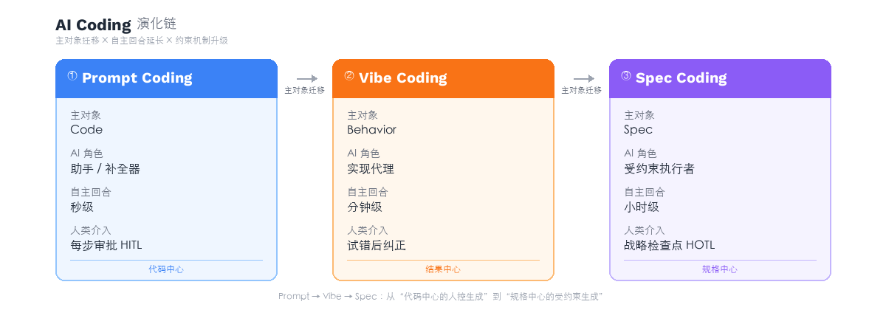
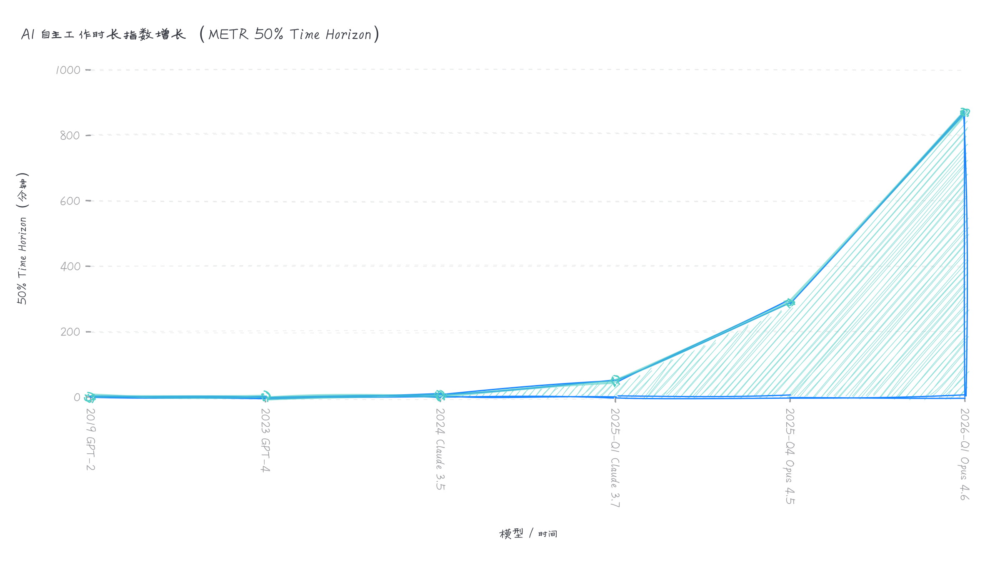
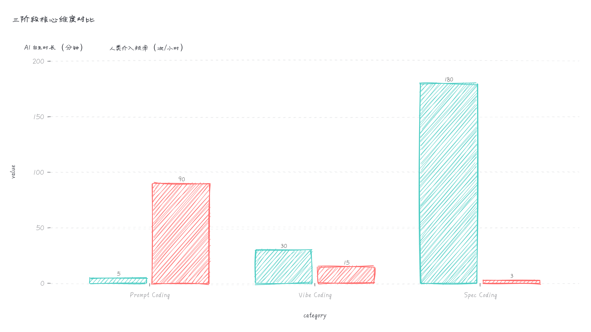

# AI Coding 方式演进：从 Prompt Coding 到 Vibe Coding 再到 Spec Coding

> 每一次范式跃迁，都在做同一件事——让 AI 自主工作得更久，让人类介入得更少、更精准。

---

## 引言：我们到底在用 AI 怎么写代码？

2025 年，几乎所有开发者都在用 AI 写代码。但如果你仔细观察，会发现大家用的方式截然不同。

有人在 IDE 里按 Tab 接受 Copilot 的补全建议，逐行审阅每一处改动——AI 每写几秒钟，人就要看一眼。有人在 Cursor 里用自然语言描述需求，跑起来看效果，不对就继续说——AI 可以连续工作几分钟，人只在结果不对时介入。还有人在项目里维护一份 spec 文档，让 AI Agent 按照规格一步步实施——AI 自主运行数小时，人只在关键检查点出现。

注意到规律了吗？**从几秒到几分钟到几小时——AI 两次"被打断"之间的自主工作时长在持续延长，而人类介入的频率在持续降低。**

这不是巧合。这三种方式代表了 AI 编程的三个演化阶段，背后有两条交织的主线：**"主对象"在迁移**（从代码到运行效果到规格文档），**"自主回合"在延长**（AI 能独立工作的时间越来越长，人类从逐步审批走向战略性监督）。

业界对此并非没有讨论。从 Vibe Coding 到 Spec Coding 的跃迁，已经是 2025 下半年以来的行业叙事主线——AWS 推出 Kiro 定位"Beyond Vibe Coding"，Martin Fowler 撰文探讨 Spec-Driven Development，Red Hat 将 SDD 与 Vibe Coding 做了系统对比。METR 的量化研究则揭示了底层驱动力：AI 能自主完成的任务时长每 7 个月翻一倍，而 Anthropic 的实测数据显示人类的监督频率正在同步下降。但大多数讨论要么聚焦于两两对比（Prompt vs Vibe，或 Vibe vs Spec），要么使用不同的切分维度（如 36 氪用"补全范式 vs Agent 范式"从技术架构层面划分）。

本文试图做的事情是：**将三者串成一条完整的演化链，用"主对象迁移"解释表层体验的变化，用"自主回合延长"解释底层驱动力。**

**Prompt Coding → Vibe Coding → Spec Coding**

每一次跃迁，变的不只是工具，而是**谁在看代码、AI 能独立跑多久、人类靠什么保证方向正确**。

---

## 一、为什么不是 Tab Coding 或 AI-assisted Coding？

在确定这条演化链之前，有两个候选名称需要排除。

### Tab Coding：太窄

"Tab Coding"听起来很形象——在编辑器里写代码，AI 给出 inline 补全建议，你按 Tab 接受。这确实是 GitHub Copilot 早期最典型的交互方式，GitHub 官方至今仍将这类能力描述为"inline suggestions"和"AI-powered pair programmer"。

但问题是，**Tab Coding 只是一种具体的交互动作**。它无法覆盖"在聊天框里让 AI 写一个函数""把报错信息贴给 AI 让它修""让 AI 解释一段遗留代码"这些同样属于早期 AI 编程的场景。用一个 UI 交互细节去命名一整个阶段，格局太小。

### AI-assisted Coding：太宽

"AI-assisted Coding"看似稳妥，但它是一个**总类**。Vibe Coding 是 AI 辅助的，Spec Coding 也是 AI 辅助的——你不能拿总类当作演化链的第一阶段。GitHub 文档本身就把 Copilot 统称为"AI coding assistant / coding agent"，这是一个跨越所有阶段的标签。

### 所以，Prompt Coding

**Prompt Coding** 抓住了第一阶段最核心的特征：**人开始通过 prompt 驱动代码生成，但代码仍然是第一工作对象，工程控制权仍主要在人手里。**

需要说明的是，"Prompt Coding"并非本文首创的术语——已有开发者在博客中使用过这个词来描述与 Vibe Coding 相对的编程方式。但它尚未形成行业共识级别的术语地位，也没有被放进一条三阶段演化链中使用。本文选择它，不是因为它新，而是因为它**精确**——它指向的是那个"人用 prompt 驱动 AI，但代码仍是第一现场"的阶段，不多不少。

---

## 二、三个阶段的深度拆解

### 阶段一：Prompt Coding

**一句话概括：Prompt 是输入手段，Code 是主战场。**

#### 定义

开发者通过 prompt、chat、补全建议等方式驱动 AI 产出代码，但代码本身仍是第一工作对象；人会频繁阅读、修改、拼接、验证生成结果，AI 主要扮演"高阶补全器 / 搭子 / 局部执行者"。

#### 典型状态

- 你让 AI 写一个函数、改一段逻辑、补测试、解释报错
- 你通常还是会看 diff、看代码、自己做集成
- 你的工作流主轴仍是 IDE + code review + 人工判断
- AI 是加速器，不是决策者

#### 典型工具形态

- GitHub Copilot（inline suggestions）
- ChatGPT / Claude 的代码对话
- IDE 内置的 AI Chat 面板
- 各种 AI 代码补全插件

#### 这个阶段的本质

开发者的心智模型没有变。你仍然在"写代码"，只是写得更快了。AI 像一个时刻在线的 pair programmer，你说一句它补一段，但**每一行代码最终都要过你的眼**。

这和 GitHub 对 Copilot 的定位完全吻合——即便在 2025 年 Copilot 已经具备 coding agent 能力，GitHub 官方文档仍然强调：开发者要 review、提交、合并与负责。

#### 典型风险

**局部快，全局乱。** 每个片段看着都对，但整体架构可能在不知不觉中走向混乱。因为 AI 在每次补全时没有全局视野，而开发者在享受加速快感时容易忽略整体一致性。

---

### 阶段二：Vibe Coding

**一句话概括：Intent 是主输入，Behavior 是主反馈，Code 退居后台。**

#### 定义

开发者主要用自然语言表达意图，不再持续细读代码，而是通过"跑起来看效果 → 继续改"的方式推进；关注体验和结果，多于关注实现细节。

#### 起源

这个词由 Andrej Karpathy 在 2025 年 2 月 2 日首次提出。他在 X 上描述了自己的编程状态：几乎不碰键盘，全程用语音对 Cursor Composer 描述需求，接受所有建议而不逐行审查 diff，遇到 bug 就把错误信息粘贴给 AI——代码不断增长，已经超出他个人的理解范围，但"它能跑"。随后他正式定义：

> There's a new kind of coding I call "vibe coding", where you fully give in to the vibes, embrace exponentials, and forget that the code even exists.

这条推文迅速走红。2025 年 3 月 Merriam-Webster 将"vibe coding"收录为俚语词条，Google Trends 显示相关搜索量增长了 2400%，Collins 英语词典更将其评为 2025 年度词汇。

Simon Willison 后续多次强调：Vibe Coding 不是泛指 AI 辅助编程，而是"生成代码但并不在意代码本身"的那种方式。

这个区分很重要。**不是所有用 AI 写代码的人都在 Vibe Coding——只有那些"不看代码、只看结果"的人才是。**

#### 典型状态

- 你用自然语言描述你想要的功能："加一个深色模式切换按钮"
- AI 生成了一堆代码，你不看代码，直接运行
- 效果对了，继续下一个需求；效果不对，用自然语言描述问题让 AI 再改
- 你可能完全不理解生成的代码是怎么工作的
- 你的反馈回路是：运行 → 观察 → 描述 → 再运行

#### 典型工具形态

- Cursor（Agent 模式）
- Bolt / Lovable / v0（一句话生成整个应用）
- Replit Agent
- Claude Code（交互式对话开发）

#### 这个阶段的本质

**代码不再是"第一现场"。** 开发者关注的是运行效果——页面长什么样、功能能不能用、交互对不对。代码变成了一种中间产物，就像编译器生成的汇编代码——你知道它在那里，但你不去看它。

这是一个心智模型的质变。在 Prompt Coding 阶段，你还是一个"写代码的人"；在 Vibe Coding 阶段，你更像一个"描述意图的人"。

#### 典型风险

**可维护性差，理解债务高。** Vibe Coding 天然适合原型、MVP、一次性项目。但如果你要长期维护一个系统，不理解代码就意味着你无法调试、无法重构、无法在 AI 犯错时纠正它。

Karpathy 自己也承认：Vibe Coding 适合"throwaway weekend projects"，不适合生产级系统。

---

### 阶段三：Spec Coding

**一句话概括：Spec 是源头，Code 是落实。**

#### 定义

开发不再直接从 prompt 或 vibe 开始，而是先形成 spec / requirements / design / tasks 等结构化约束，再由 AI 依据 spec 实施；spec 成为人和 AI 的共同源头与约束面。

#### 背景

Spec Coding 的出现是对 Vibe Coding 缺陷的直接回应。当人们发现 Vibe Coding 在原型之外难以为继时，一个自然的问题浮出水面：**如果不看代码，那靠什么保证系统的正确性和可维护性？**

答案是：**靠 spec。**

这个方向在 2025 下半年迅速获得了行业级的认可：

- **AWS 推出 Kiro**——一款 spec-driven 的 AI IDE，其名字取自日语"岐路"（きろ），象征传统开发与 AI 加速的交叉点。Kiro 将 SDD 工作流拆为三个支柱：Requirements（定义做什么）→ Design（设计怎么做）→ Tasks（分解执行计划），每一步都有结构化产出。InfoQ 的报道标题直接用了"Beyond Vibe Coding"。
- **Martin Fowler 发表 *Exploring Gen AI: Spec-Driven Development***——他将 SDD 进一步细分为三种模式：**spec-first**（先写 spec，实现后丢弃 spec）、**spec-anchored**（spec 保留供参考）、**spec-as-source**（spec 成为源头，代码可从 spec 重新生成）。Fowler 认为 spec-as-source 目前仍有些理想化，但行业正在向 spec-anchored 和 spec-as-source 之间收敛。
- **Red Hat Developer** 将 Vibe Coding 比作"爵士即兴——当时精彩，但撑不起一场巡演"，而 SDD 是让 AI 编码达到"95% 以上准确度"的工程化路径。
- **Atlassian** 在推出 Rovo Dev 时引用了 Fowler 关于"语义扩散"的警告，强调 SDD 的定义仍在快速漂移，需要警惕概念被滥用。
- **学术界** 也开始跟进——arXiv 上出现了题为 *Spec-Driven Development: From Code to Contract in the Age of AI Coding Assistants* 的论文（2026 年 1 月）。
- **中文社区** 同样活跃：36 氪/InfoQ 的年终盘点提出"Spec 正在蚕食人类编码"；独立开发者博客出现了"发散靠 Vibe，收敛靠 Spec"的两阶段工作流实践。

这不是偶然——这是整个行业在"vibe 不够用"之后的集体回应。

#### 典型状态

- 你先写（或和 AI 共同生成）一份 spec：需求、设计决策、任务分解、验收标准
- AI 按照 spec 逐步实施，每一步都有明确的输入约束和输出验证
- 你不需要逐行审阅代码，但你要审阅 spec 是否被正确遵守
- 测试是 spec 的可执行版本，自动验证实现与规格的一致性
- spec 不是一次性提示词，而是持续锚定实现与演进的核心文档

#### 典型工具形态

- Kiro（AWS 推出的 spec-driven AI IDE）
- Anthropic Claude Code + CLAUDE.md（spec 即 context）
- Cursor Rules / .cursorrules（项目级约束）
- AISDLC（AI Software Development Lifecycle 框架）
- 各种自定义的 spec → task → implement 工作流

#### 这个阶段的本质

**Spec 成为"第一现场"。** 开发者的核心工作从"写代码"或"描述意图"变成了"定义规格"。代码是 spec 的实现，测试是 spec 的验证，文档是 spec 的衍生物。

这看起来像是软件工程的"复古"——瀑布模型不也强调先有规格再实现吗？但关键区别在于：**传统的 spec 是人写给人看的，而 Spec Coding 的 spec 是人写给 AI 执行的。** 这意味着 spec 的颗粒度、结构化程度和可执行性要求远高于传统需求文档。

#### 典型风险

**前置成本高，流程更重。** 写 spec 需要时间和思考，这对于快速原型和探索性开发来说是一种负担。如果 spec 本身有误，AI 会忠实地实现一个错误的系统。此外，spec 的维护也是一个问题——系统演进时，spec 必须同步更新，否则就会变成误导性文档。

值得注意的是，36 氪的年终盘点对此有一个重要的澄清：**Spec 不等同于上下文工程（Context Engineering）**。Spec 是上下文中最关键的稳定部分——"一切用于指导代码生成的契约总和"，而 Context Engineering 是更广义的动态上下文管理。Spec 应被理解为"活的契约"，在 Plan-Execute 闭环中动态校准，而非前置的静态文档——"这反而比传统开发更接近工程真实状态"。

---

## 三、核心对比

### 一张表看清三个阶段

| 维度 | Prompt Coding | Vibe Coding | Spec Coding |
|------|--------------|-------------|-------------|
| **主输入** | prompt / 补全请求 | 意图 / 自然语言 | spec / requirements / tasks |
| **主工作对象** | code | behavior / outcome | spec + code（以 spec 为锚） |
| **主反馈方式** | 看代码、看 diff、跑测试 | 运行效果、界面观感 | 检查是否符合 spec、测试闭环 |
| **人的责任重心** | 写对代码、拼对实现 | 快速试错、结果导向 | 保证一致性、可追踪、可协作 |
| **AI 的角色** | 助手 / 补全器 / 搭子 | 实现代理 / 黑箱实现者 | 受约束的执行者 / 规格解释器 |
| **系统稳定性靠** | 人读代码、测代码 | 快速试错与体感验证 | 规格、分解、测试与追踪闭环 |
| **典型风险** | 局部快，全局乱 | 可维护性差、理解债务 | 前置成本高、流程更重 |
| **适合场景** | 日常开发、已有代码库维护 | 原型、MVP、一次性项目 | 团队协作、长期项目、生产系统 |

### 三条本质分界线

**第一条：代码是不是"第一现场"**

- Prompt Coding：**是**，代码就是第一现场，你在代码里工作
- Vibe Coding：**不是**，运行效果才是第一现场，代码是黑箱
- Spec Coding：**也不是**，spec 才是第一现场，代码是 spec 的落实

**第二条：AI 被当成什么**

- Prompt Coding：**助手**——你在写，它在帮你写得更快
- Vibe Coding：**代理**——你在说，它在替你做
- Spec Coding：**执行者**——你在定义规则，它在规则内执行

**第三条：系统稳定性靠什么保证**

- Prompt Coding：靠**人读代码、测代码**——传统工程能力仍是核心
- Vibe Coding：靠**快速试错与体感验证**——如果跑起来没问题就是没问题
- Spec Coding：靠**规格、任务分解、测试与追踪闭环**——形式化保证

---

## 四、这不是线性替代，而是光谱共存

一个常见的误解是：后一个阶段会"替代"前一个。事实并非如此。

**即使在 Spec Coding 成熟的今天，一个资深开发者的日常工作很可能同时使用三种方式：**

- 修一个小 bug → Prompt Coding（让 AI 补全修复代码，自己 review）
- 探索一个新 UI 方案 → Vibe Coding（快速生成几个版本，看哪个感觉对）
- 实现一个核心业务模块 → Spec Coding（先定义规格和测试，再让 AI 实施）

选择哪种方式取决于三个因素：

1. **项目的寿命**：一次性脚本 vs 长期维护的系统
2. **错误的代价**：内部工具 vs 面向用户的核心功能
3. **协作的需求**：个人项目 vs 团队协作

光谱的一端是最大自由度（Vibe Coding），另一端是最大可控性（Spec Coding），Prompt Coding 在中间提供了灵活的平衡点。

---

## 五、演化背后的深层逻辑：延长 AI 的自主回合，减少人的碎片消耗

为什么 AI 编程会沿着 Prompt → Vibe → Spec 这条路径演化？

表面上看，是工具在迭代。但如果抽出一条贯穿三个阶段的主线，答案是：**每一次范式跃迁，都在做同一件事——延长 AI 可以自主工作的时长，缩短人类需要介入的频率。**

这不是本文的独创观点。从 METR 的量化研究到 Anthropic 的产品设计，从 Karpathy 的"Autonomy Slider"到 Addy Osmani 的"Conductor → Orchestrator"框架，业界已在多个维度形成了共识。

### 数据：AI 自主工作时长正在指数增长

METR（Model Evaluation and Threat Research）定义了一个关键指标——**"50% time horizon"**：AI agent 能以 50% 成功率完成的任务长度（以人类专家完成同等任务所需时间衡量）。

这个指标正在指数增长，**每 7 个月翻倍**：

| 时间节点 | 模型 | 50% Time Horizon |
|---------|------|-----------------|
| 2019 | GPT-2 | ~2 秒 |
| 2025 年初 | Claude 3.7 Sonnet | ~50 分钟 |
| 2025 年末 | Claude Opus 4.5 | ~289 小时 |
| 2026 年初 | Claude Opus 4.6 | ~870 小时 |

> "If these results generalize to real-world software tasks, extrapolation of this trend predicts that within 5 years, AI systems will be capable of automating many software tasks that currently take humans a month."
> — METR, *Measuring AI Ability to Complete Long Software Tasks*, 2025

与此同时，Anthropic 的实测数据显示：Claude Code 用户允许 AI 无打断运行的时长，在三个月内（2025-10 至 2026-01）从不足 25 分钟增长到超过 45 分钟——**几乎翻倍**。新用户约 20% 的时间使用全自动批准模式，到 750 次会话后，这一比例超过 40%。

最极端的案例来自 Rakuten：工程师将 Claude Code 指向 vLLM 的 1250 万行代码库，AI **自主工作了 7 小时**，达到 99.9% 的数值精度，全程无人类代码贡献。

### 问题：监督本身正在成为瓶颈

为什么要延长 AI 的自主回合？因为**频繁的人类介入不是免费的，它本身是一种隐性成本**。

AWS CTO Werner Vogels 在 re:Invent 2025 上提出了一个精确的概念——**"Verification Debt"（验证债务）**：

> "You will write less code, 'cause generation is so fast. You will review more code, because understanding it takes time. When you write code yourself, comprehension comes with creation. When the machine writes it, you have to rebuild that comprehension during review. That's verification debt."

这个概念揭示了一个反直觉的现实：**AI 加速了代码生成，却在人类端创造了对等的验证负担。** 如果范式不演进，开发者只是从"写代码"转变为"审代码"——总工时并未减少，只是重新分配了。

数据支持了这一判断：

- METR 2025 年 7 月的 RCT 实验发现：资深开发者使用 AI 工具后实际**慢了 19%**，尽管他们认为自己快了 20%——一个 40 个百分点的感知差距。核心原因是"编排开销"：开发者需要在"指导 AI"和"思考真正的问题"之间不断切换认知模式
- Sonar 2026 年报告：开发者**每周 24% 的时间**花在检查和修复 AI 输出上；38% 的人认为审查 AI 代码比审查人工代码需要**更多**精力
- LinearB 数据：Copilot 重度参与的 PR，review 时间**增加了 26%**
- 学术研究（arXiv:2512.14012）发现：即便面对 70 步以上的计划，职业开发者平均每 **2.1 步**就要介入一次——他们会明确告诉 AI："Please do just step 1 now."

这就是当前范式的核心矛盾：**AI 的能力在指数增长，但人类的监督模式还停留在逐步审批阶段。**

### 三个阶段如何分别回应这个矛盾

理解了"延长自主回合、减少碎片消耗"这一驱动力，三个阶段的演进逻辑就变得非常清晰：

**Prompt Coding 的问题：高频中断，注意力碎片化。** 每个补全都需要即时评估：接受还是拒绝？改一下还是重写？AI 补全触发大脑的"新奇响应"，开发者在"编码模式"和"审阅模式"之间每小时切换数十次。研究表明，进入 flow 状态需要约 52 分钟不间断工作，被打断后需要 10-45 分钟恢复上下文。Prompt Coding 的本质是**interrupt-driven work**——它用 AI 加速了每个片段，却碎片化了整体节奏。

**Vibe Coding 的回应：降低审阅频率，但把成本后移。** Vibe Coding 通过"不看代码"大幅降低了人类的中间审阅频率——你不需要逐行 review，只需要看运行效果。这确实让开发者的注意力更连贯了。但代价是：试错循环替代了 code review。66% 的开发者面临"差一点但不完全对"的生产力税，调试自己不理解的代码比写出来更耗时。Karpathy 本人在 2026 年初也承认 Vibe Coding"已过时"，他新提出的"agentic engineering"恰恰强调"更多监督和审查，而非更少"。

**Spec Coding 的解法：前置成本，换取后续的批量化自主。** Spec Coding 的核心洞察是——**与其在 AI 工作过程中频繁打断、逐步审批，不如在开始之前一次性定义清楚规则，然后让 AI 在规则内自主运行更长时间。** 前置写 spec 的时间投入，换来的是后续 AI 可以连续执行 20 个、200 个甚至更多步骤而不需要人类干预。人类的注意力从"高频低质的逐行 approve"转向"低频高质的架构级 review"。

Addy Osmani 将这个转变精确地描述为从**指挥家（Conductor）**到**编排家（Orchestrator）**：

> 指挥家模式：每步同步参与，委托粒度是函数/片段级，人类"actively engaged nearly 100% of the time"。
> 编排家模式：前置任务规格说明，后置代码审查，中间完全委托给 AI 并行执行，"trading off fine-grained control for breadth of throughput"。

快手的工程实践提供了量化印证：他们将开发模式分为 L1（AI 辅助，人拆任务分配给 AI 再审核）、L2（AI 协同，完全用自然语言交互）、L3（AI 自主，人只定义需求和验收）。**当 L2 和 L3 级需求占比达到 20.34% 时，需求交付周期下降了 58%。**

### 委托粒度与约束机制：一体两面

"延长自主回合"的前提是"委托粒度"必须同步扩大，而"约束机制"必须同步升级——三者是一体的：

| 阶段 | 委托粒度 | AI 自主回合 | 约束机制 | 人类介入模式 |
|------|---------|-----------|---------|------------|
| Prompt Coding | 行级 / 函数级 | 秒级（每个补全） | 人工 code review | 每步审批（HITL） |
| Vibe Coding | 功能级 / 页面级 | 分钟级（每轮对话） | 运行时验证 | 试错后纠正 |
| Spec Coding | 模块级 / 系统级 | 小时级（整个任务） | 形式化规格 + 自动测试 | 战略检查点（HOTL） |

这里有一个关键的架构演化——**从 Human-in-the-Loop（HITL）到 Human-on-the-Loop（HOTL）**。HITL 要求每步人工批准，这在 Prompt Coding 阶段是必须的（因为没有其他约束）；HOTL 则允许 AI 在边界内自主运行，人类只在异常或关键节点介入。Spec 就是这个"边界"的形式化表达。

Anthropic Research 在其 2026 年报告中明确了这一方向：

> "Effective oversight of agents will require new forms of post-deployment monitoring infrastructure and new human-AI interaction paradigms that help both the human and the AI manage autonomy and risk together."

即：不应要求逐步审批（这会无谓增加摩擦），应建立"监控式监督"而非"批准式监督"。

### 与其他分析框架的关系

"延长自主回合 + 减少碎片消耗"这一主线，与业界的其他分析框架高度兼容：

- **Gene Kim & Steve Yegge 的三循环理论**将开发者工作分为 Inner Loop（编写代码）、Outer Loop（CI/CD、PR、部署）、及更外层的产品循环。他们指出 AI 已占领内循环，正在向外循环扩张——"Github estimates that 92% of U.S.-based developers are already using AI coding tools... By contrast, the outer loop has been left to struggle"。
- **Karpathy 的 "Autonomy Slider"** 概念（Tab → cmd+K → Cmd+L → Agent mode）直接可视化了自主度的连续谱。他用 Tesla Autopilot 类比：12 年持续演进的方向始终是"减少人类需要介入的频率"。
- **36 氪的"补全范式 vs Agent 范式"**从技术架构角度解释了同一个现象：补全范式受时延约束，模型必须在毫秒内响应，天然只能做行级委托；Agent 范式解除了时延约束，才使得分钟级、小时级的自主工作成为可能。
- **IBM Research 的 "Objective-Validation Protocol"** 和 **Martin Fowler 的 SDD 三层模型**（spec-first / spec-anchored / spec-as-source）则在更细的粒度上描述了"检查点间隔"和"spec 的持久性"如何共同演化。

这些框架不矛盾，而是互补的。本文用"主对象变了"来描述**开发者体验**的变化，用"自主回合在延长"来描述**驱动力**，用"约束机制在升级"来描述**保障条件**——三者共同构成了一个完整的解释框架。

### 终极方向：Code as Artifact

如果延续这条演化线——自主回合持续延长，人类检查点持续后移——一个可能的终局是：**代码完全变成一种中间制品（artifact）**，就像今天的字节码、IL 代码、编译产物一样，人类不再直接阅读和编写它。

人类的工作将完全发生在 spec 层：定义需求、设计约束、验收标准。AI 负责从 spec 到 code 的全部转换，并通过自动化测试保证一致性。人类的"检查点"从"逐行审阅代码"简化为"验收 spec 是否被正确实现"。

这正是 Martin Fowler 所说的"spec-as-source"——spec 不只是参考文档，而是**唯一的源头**，代码可以从 spec 重新生成。

Dario Amodei 在《Machines of Loving Grace》中描绘的正是这幅图景：

> "It can be given tasks that take hours, days, or weeks to complete, and then goes off and does those tasks autonomously, in the way a smart employee would, asking for clarification as necessary."

Sam Altman 的预测更加直接：AI agent 将"potentially working for days without interruption"。

这不是科幻。METR 的数据表明，按当前每 7 个月翻倍的速度，5 年内 AI 将能自主完成人类需要一个月才能完成的软件任务。Spec Coding 正是为这个未来提前建立的约束框架——**当 AI 可以连续工作数天时，你用什么来保证它走在正确的方向上？答案是 spec。**

---

## 六、对开发者的实际意义

### 如果你还在纯 Prompt Coding 阶段

你的工程能力仍然是核心竞争力，但你可能正在错过效率的巨大提升。尝试在低风险场景下放手让 AI 多做一些——不是每一行代码都需要你亲眼过目。

### 如果你正在享受 Vibe Coding

享受它带来的创造力释放，但要对它的边界保持清醒。Vibe Coding 是一种非常强大的探索工具，但它不是构建可靠系统的方法。当项目从原型走向产品时，你需要引入更多的结构和约束。

### 如果你正在实践 Spec Coding

你走在了前面。但要注意不要过度工程化——不是所有任务都需要完整的 spec 流程。关键是判断什么时候需要 spec 的严谨性，什么时候 vibe 的灵活性反而更合适。

### 对所有开发者

**最重要的能力变化是：从"写代码的能力"转向"定义问题的能力"。** 在 Prompt Coding 阶段，你需要知道怎么写代码；在 Vibe Coding 阶段，你需要知道你想要什么；在 Spec Coding 阶段，你需要精确地定义"什么是对的"。

这三种能力是递进的，而不是替代的。最好的开发者会同时掌握三种模式，并根据场景灵活切换。

---

## 结语：一句话总结

**Prompt Coding → Vibe Coding → Spec Coding**

代表 AI 编程从"代码中心的人控生成"，演化到"结果中心的高委托生成"，再演化到"规格中心的受约束生成"。

代码正在从"开发者的作品"变成"AI 的输出物"。在这个转变中，**定义"什么是对的"**比"怎么写代码"更加重要。

这不是代码的消亡。这是代码的归位——回到它本来就应该在的位置：一种实现手段，而非最终目的。

---

## 参考与延伸阅读

**演化框架与定义**
- Andrej Karpathy, ["Vibe Coding" 原始推文](https://x.com/karpathy/status/1886192184808149383), 2025-02-02
- Andrej Karpathy, [Software 3.0 & Autonomy Slider](https://www.latent.space/p/s3), Y Combinator AI Startup School, 2025-06
- Martin Fowler, [Exploring Gen AI: Spec-Driven Development](https://martinfowler.com/articles/exploring-gen-ai.html), 2025
- Martin Fowler, [How far can we push AI autonomy in code generation?](https://martinfowler.com/articles/pushing-ai-autonomy.html), 2025
- Addy Osmani, [The Future of Agentic Coding: Conductors to Orchestrators](https://addyosmani.com/blog/future-agentic-coding/), O'Reilly Radar
- Gene Kim & Steve Yegge, [The Three Developer Loops: A New Framework for AI-Assisted Coding](https://itrevolution.com/articles/the-three-developer-loops-a-new-framework-for-ai-assisted-coding/), IT Revolution

**AI 自主能力与量化研究**
- METR, [Measuring AI Ability to Complete Long Software Tasks](https://arxiv.org/abs/2503.14499), arXiv, 2025-03
- METR, [Task-Completion Time Horizons](https://metr.org/time-horizons/), 实时追踪页
- METR, [Measuring the Impact of Early-2025 AI on Experienced Open-Source Developer Productivity](https://metr.org/blog/2025-07-10-early-2025-ai-experienced-os-dev-study/), 2025-07
- Anthropic Research, [Measuring AI Agent Autonomy in Practice](https://www.anthropic.com/research/measuring-agent-autonomy), 2026-02
- Anthropic, [Enabling Claude Code to Work More Autonomously](https://www.anthropic.com/news/enabling-claude-code-to-work-more-autonomously), 2026
- Anthropic, [2026 Agentic Coding Trends Report](https://resources.anthropic.com/hubfs/2026%20Agentic%20Coding%20Trends%20Report.pdf), 2026
- arXiv, [Professional Software Developers Don't Vibe, They Control](https://arxiv.org/abs/2512.14012), 2025-12
- arXiv, [SWE-Bench Pro: Can AI Agents Solve Long-Horizon Software Engineering Tasks?](https://arxiv.org/abs/2509.16941), 2025

**人类时间成本与监督开销**
- Sonar, [Critical Verification Gap in AI Coding](https://www.sonarsource.com/company/press-releases/sonar-data-reveals-critical-verification-gap-in-ai-coding/), 2026-01
- LinearB, [Is GitHub Copilot Worth It?](https://linearb.io/blog/is-github-copilot-worth-it), 2025
- Stack Overflow, [2025 Developer Survey – AI Section](https://survey.stackoverflow.co/2025/ai), 2025
- Werner Vogels (AWS CTO), [Verification Debt](https://www.kevinbrowne.ca/verification-debt-is-the-ai-eras-technical-debt/), re:Invent 2025

**Spec-Driven Development**
- AWS, [Introducing Kiro](https://kiro.dev/blog/introducing-kiro/), 2025
- InfoQ, [Beyond Vibe Coding: Amazon Introduces Kiro](https://www.infoq.com/news/2025/08/aws-kiro-spec-driven-agent/), 2025
- Red Hat Developer, [How spec-driven development improves AI coding quality](https://developers.redhat.com/articles/2025/10/22/how-spec-driven-development-improves-ai-coding-quality), 2025
- Atlassian, [Spec-Driven Development with Rovo Dev](https://www.atlassian.com/blog/developer/spec-driven-development-with-rovo-dev), 2025
- Thoughtworks, [Spec-driven development — Unpacking 2025's key new AI-assisted engineering practices](https://www.thoughtworks.com/en-us/insights/blog/agile-engineering-practices/spec-driven-development-unpacking-2025-new-engineering-practices), 2025
- arXiv, [Spec-Driven Development: From Code to Contract](https://arxiv.org/html/2602.00180v1), 2026-01

**行业领袖观点**
- Dario Amodei, [Machines of Loving Grace](https://www.darioamodei.com/essay/machines-of-loving-grace), 2024
- Sam Altman, [AI Agents Will Enter Workforce](https://www.axios.com/2025/01/10/ai-agents-sam-altman-workers), Axios, 2025-01
- The New Stack, [Vibe Coding is Passé: Karpathy Has a New Name](https://thenewstack.io/vibe-coding-is-passe/), 2026

**中文社区实践**
- 36 氪 / InfoQ, [AI Coding 年终盘点：Spec 正在蚕食人类编码](https://36kr.com/p/3617659484013831), 2025
- 腾讯新闻, [快手 AI Coding 三级开发模式（L1/L2/L3）](https://news.qq.com/rain/a/20260211A03JZX00), 2026-02
- xkcoding, [从 Vibe 到 Spec：我的 AI Coding 工作流](https://xkcoding.com/2026-01-22-vibe-to-spec-ai-coding-workflow.html), 2026-01
- Bobm, [Prompt Coding vs. Vibe Coding](https://medium.com/@bobm67/prompt-coding-vs-vibe-coding-navigating-the-future-of-ai-assisted-development-039d6946308c), Medium
- Wikipedia, [Vibe coding](https://en.wikipedia.org/wiki/Vibe_coding)

---

*写于 2026 年 3 月*
